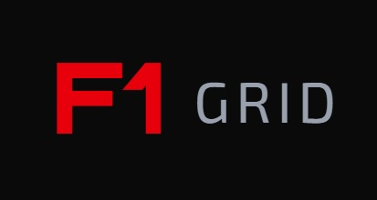

<table style="border-collapse: collapse; border: none;">
<tr style="border: none;">
<td style="vertical-align: middle; border: none;">
  
</td>
<td style="vertical-align: middle; border: none; padding-left: 15px;">
  <h1 style="margin: 0;">The Grid Experience</h1>
  <p style="margin: 5px 0 0 0; font-size: 16px; color: #666;">
    Don't just Race - Bet, Trade and Speculate.
  </p>
</td>
</tr>
</table>

### *Don't just Race — Bet, Trade, and Speculate.*

Grid Experience is a Web3-powered racing–economy simulator where AI-driven F1-inspired racers compete in virtual tournaments, and every race moment dynamically affects the live on-chain market value of racer NFTs.  

Players don't just watch the race — they own, trade, bid, and speculate on racers whose values fluctuate in real time based on performance, AI strategy, and market movements.

Think Formula 1 × Stock Market × GameFi.

## 📸 Screenshots of the Web Page


---

## 🏎️ Core Concept

Each racer in The Grid Experience is represented as an NFT.  

An AI-driven valuation engine continuously updates its value based on:

- Overtakes  
- Crashes or performance drops  
- Speed and lap-time improvements  
- Market speculation  
- Active bidding pressure  
- Race momentum trends  

This creates a **live financial ecosystem** where both racing strategy and trading instincts determine profit.

---

## 📌 Features

### **1. Real-Time AI-Simulated F1 Racing**

- AI racers have stats like speed, cornering, stability, aggression, consistency, and reflexes.
- Race simulation generates lap-by-lap telemetry.
- Visual updates via WebSocket.
- **3D Interactive Racing Stage** with physics-based car movement (`components/f1-interactive-stage.tsx`)

---

### **2. Dynamic NFT Pricing Engine**

- Prices are updated continuously using:
  - Performance score  
  - Momentum score  
  - Market interest  
  - Auction pressure  
  - Volatility curve  
- A weighted model calculates the real-time value of each racer.
- Values can spike instantly when pivotal events occur (e.g., overtake, crash).

---

### **3. Real-Time Auctions (Core Gameplay Loop)**

- Users can bid during:
  - Pre-race auctions  
  - Live race auctions  
  - Post-race settlements  
- Highest bidder wins the NFT with instant ownership transfer.
- Bidding influences the valuation score.

---

### **4. Trader Dashboard**

The dashboard displays:
- Live charts  
- Recent trades  
- Market depth  
- Active auctions  
- Personal holdings  
- Price movement indicators  
- **F1 Car Features Dashboard** (`app/dashboard/page.tsx`) with interactive car selection

---

### **5. Game Page / Race Viewer**

Displays real-time race visuals:
- Racer positions  
- Lap count  
- Speed indicators  
- Gap times  
- Track map  
- Price impact markers showing which racer gained/lost value  
- **Multiplayer Racing** (`app/multiplayer/page.tsx`) with real-time synchronization

---

### **6. Wallet, Authentication & Profile**

- Users connect via MetaMask/WalletConnect  
- Wallet displays owned racers  
- Users can buy, sell, stake, and participate in auctions  

---

### **7. NFT Detail Page**

Shows the racer's:
- Stats  
- AI profile  
- Price history chart  
- Ownership history  
- Live performance metrics  

---

### **8. Multiplayer Racing Experience**

- Real-time multiplayer racing with WebSocket synchronization
- Physics-based car controls using React Three Fiber
- Live leaderboard and scoring system
- Server connection management for local/network play

---

## 📂 Project Structure & Branch Explanations

### **Root Directory Structure**

```text
root/
├── app/                          # Next.js 16 App Router (Main Application)
│   ├── page.tsx                  # Landing page with hero section
│   ├── dashboard/                 # Car features dashboard
│   │   └── page.tsx              # Main dashboard with car selection
│   ├── multiplayer/              # Multiplayer racing page
│   │   └── page.tsx              # Real-time multiplayer racing interface
│   ├── bet-now/                  # Betting interface
│   │   └── page.tsx              # Betting page for races
│   ├── contact/                  # Contact page
│   │   └── page.tsx              # Contact form and information
│   ├── layout.tsx                # Root layout with providers
│   └── globals.css               # Global styles
│
├── components/                    # React Components Library
│   ├── f1-interactive-stage.tsx  # 3D racing stage with physics
│   ├── f1-car-features-dashboard.tsx  # Car selection dashboard
│   ├── landing-hero.tsx          # Landing page hero section
│   ├── navbar.tsx                # Navigation bar
│   ├── footer.tsx                 # Footer component
│   ├── music-player.tsx           # Background music player
│   ├── telemetry-dashboard.tsx   # Race telemetry display
│   ├── leaderboard.tsx           # Race leaderboard
│   ├── gallery.tsx               # Image gallery
│   ├── multiplayer/              # Multiplayer components
│   │   ├── F1RacingScene.tsx     # 3D racing scene
│   │   ├── F1Car.tsx             # Physics-based F1 car
│   │   ├── F1Track.tsx           # Race track with boundaries
│   │   ├── components/           # Multiplayer UI components
│   │   │   ├── RemoteCar.tsx     # Remote player car rendering
│   │   │   ├── MultiplayerLeaderboard.tsx  # Live race positions
│   │   │   ├── ServerConnection.tsx       # Server connection UI
│   │   │   ├── ScoreDisplay.tsx           # Score and stats
│   │   │   └── LapNotification.tsx        # Lap completion notifications
│   │   ├── hooks/                # Multiplayer hooks
│   │   │   ├── useMultiplayer.ts # WebSocket multiplayer logic
│   │   │   ├── useScoring.ts     # Scoring system
│   │   │   └── useBetting.ts    # Betting functionality
│   │   └── styles/              # Multiplayer styles
│   │       └── F1RacingApp.css  # Racing UI styles
│   └── ui/                       # Reusable UI components (shadcn/ui)
│       ├── button.tsx
│       ├── card.tsx
│       └── ... (60+ components)
│
├── backend/                      # Main Backend Server
│   ├── server.js                 # Express server with Socket.IO
│   ├── services/
│   │   └── racingContract.js    # Smart contract integration service
│   └── scripts/
│       └── create-test-race.js  # Test race creation script
│
├── my-contracts/                 # Smart Contracts (Root)
│   ├── contracts/               # Solidity contracts
│   │   ├── NFT.sol              # ERC-721 NFT contract
│   │   ├── Marketplace.sol       # NFT marketplace
│   │   └── Auction.sol          # Auction contract
│   ├── scripts/                  # Deployment scripts
│   ├── test/                     # Contract tests
│   ├── hardhat.config.ts        # Hardhat configuration
│   └── package.json             # Contract dependencies
│
├── Hack-a-Sol-4.0-darshan/      # Hackathon Submission Branch
│   ├── car-physics/             # Physics-based racing game
│   │   ├── src/
│   │   │   ├── index.js         # Main game entry point
│   │   │   ├── F1RacingScene.jsx  # 3D racing scene
│   │   │   ├── F1Car.jsx        # Car physics implementation
│   │   │   ├── F1Track.jsx      # Track rendering
│   │   │   ├── components/      # Game UI components
│   │   │   ├── hooks/           # Game hooks (multiplayer, scoring, betting)
│   │   │   └── useF1Controls.jsx  # Car control system
│   │   └── package.json        # Game dependencies
│   │
│   ├── backend/                  # Hackathon backend
│   │   ├── server.js            # Socket.IO server for multiplayer
│   │   ├── services/
│   │   │   └── racingContract.js  # Contract service
│   │   └── package.json
│   │
│   ├── multiplayer-backend/     # Dedicated multiplayer server
│   │   ├── server.js            # WebSocket server
│   │   └── README.md            # Setup instructions
│   │
│   └── my-contracts/            # Hackathon smart contracts
│       ├── contracts/           # Solidity files
│       └── hardhat.config.ts
│
├── f1-racing-game/              # Standalone F1 Racing Game
│   ├── src/
│   │   ├── App.jsx              # Main game component
│   │   ├── components/          # Game components
│   │   ├── pages/               # Game pages
│   │   ├── hooks/               # Game hooks
│   │   └── utils/               # Game utilities
│   └── package.json
│
├── public/                       # Static Assets
│   ├── assets/                  # Images, models, audio
│   │   ├── *.glb                # 3D models
│   │   ├── *.jpg, *.png        # Images
│   │   └── *.mp3               # Audio files
│   ├── car_3d/                  # 3D car assets
│   ├── r3f/                     # React Three Fiber assets
│   └── f1-logo.png             # Branding assets
│
├── assets/                       # Development Assets
│   ├── car_3d/                  # 3D car source files
│   ├── textures/                # Texture files
│   └── *.jpg, *.png            # Reference images
│
├── lib/                          # Utility Libraries
│   ├── utils.ts                 # General utilities
│   └── openf1-api.ts           # OpenF1 API integration
│
├── hooks/                        # Custom React Hooks
│   ├── use-mobile.ts            # Mobile detection
│   └── use-toast.ts             # Toast notifications
│
├── styles/                       # Global Styles
│   └── globals.css              # Global CSS
│
├── package.json                  # Main project dependencies
├── next.config.mjs              # Next.js configuration
├── tsconfig.json                 # TypeScript configuration
└── README.md                     # This file
```

---

## 🔍 Detailed Branch Functionalities

### **1. `/app` - Next.js Application Pages**

**Path:** `app/`

**Functionality:**
- **`page.tsx`**: Landing page with hero section, loader, and main navigation
- **`dashboard/page.tsx`**: Interactive car features dashboard where users select F1 cars and access gameplay options
- **`multiplayer/page.tsx`**: Real-time multiplayer racing interface with physics-based controls
- **`bet-now/page.tsx`**: Betting interface for placing bets on races
- **`contact/page.tsx`**: Contact form and information page
- **`layout.tsx`**: Root layout with theme providers and global settings

**Tech Stack:** Next.js 16 App Router, TypeScript, React 19

---

### **2. `/components` - React Component Library**

**Path:** `components/`

**Functionality:**
- **UI Components**: 60+ reusable components from shadcn/ui (buttons, cards, dialogs, etc.)
- **F1 Components**: Specialized F1 racing components
  - `f1-interactive-stage.tsx`: 3D racing stage with React Three Fiber
  - `f1-car-features-dashboard.tsx`: Car selection and features display
  - `telemetry-dashboard.tsx`: Real-time race telemetry
  - `leaderboard.tsx`: Race standings display
- **Multiplayer Components** (`components/multiplayer/`):
  - `F1RacingScene.tsx`: Main 3D racing scene with physics
  - `F1Car.tsx`: Physics-based car with controls
  - `F1Track.tsx`: Track rendering with boundaries
  - `components/RemoteCar.tsx`: Remote player visualization
  - `hooks/useMultiplayer.ts`: WebSocket multiplayer logic
  - `hooks/useScoring.ts`: Lap scoring and points system

**Tech Stack:** React, TypeScript, React Three Fiber, Framer Motion

---

### **3. `/backend` - Main Backend Server**

**Path:** `backend/`

**Functionality:**
- **`server.js`**: Express.js server with Socket.IO for real-time communication
- **`services/racingContract.js`**: Integration with smart contracts for race data
- **`scripts/create-test-race.js`**: Utility script for creating test races
- Handles WebSocket connections for multiplayer racing
- Manages race rooms and player synchronization
- Provides REST API endpoints for race data

**Tech Stack:** Node.js, Express.js, Socket.IO, Ethers.js

**Port:** Default 5002 (configurable via environment variables)

---

### **4. `/my-contracts` - Smart Contracts**

**Path:** `my-contracts/`

**Functionality:**
- **`contracts/NFT.sol`**: ERC-721 NFT contract for racer tokens
- **`contracts/Marketplace.sol`**: NFT marketplace for buying/selling racers
- **`contracts/Auction.sol`**: Auction contract for bidding on racers
- **`scripts/`**: Deployment and interaction scripts
- **`test/`**: Contract unit tests
- Manages on-chain ownership, transfers, and auction logic

**Tech Stack:** Solidity, Hardhat, Ethers.js

**Network:** Configurable (Local, Sepolia, Mainnet)

---

### **5. `/Hack-a-Sol-4.0-darshan` - Hackathon Submission**

**Path:** `Hack-a-Sol-4.0-darshan/`

**Functionality:**
- **`car-physics/`**: Complete physics-based racing game
  - React Three Fiber 3D rendering
  - Cannon.js physics engine
  - Real-time multiplayer support
  - Scoring and betting systems
- **`backend/`**: Hackathon backend server
  - Socket.IO multiplayer server
  - Race simulation engine
  - Contract integration
- **`multiplayer-backend/`**: Dedicated multiplayer server
  - WebSocket server for real-time synchronization
  - Room management
  - Player position updates
- **`my-contracts/`**: Hackathon smart contracts

**Purpose:** Complete hackathon submission with all features integrated

---

### **6. `/f1-racing-game` - Standalone Game**

**Path:** `f1-racing-game/`

**Functionality:**
- Standalone React application for F1 racing
- Separate from main Next.js app
- Can be deployed independently
- Includes game logic, components, and pages

**Tech Stack:** React, JavaScript

---

### **7. `/public` - Static Assets**

**Path:** `public/`

**Functionality:**
- **`assets/`**: Images, 3D models (.glb), audio files
- **`car_3d/`**: 3D car model assets and textures
- **`r3f/`**: React Three Fiber specific assets (tracks, environments)
- **Branding**: Logos, icons, placeholders
- Served directly by Next.js

---

### **8. `/lib` - Utility Libraries**

**Path:** `lib/`

**Functionality:**
- **`utils.ts`**: General utility functions (class names, formatting, etc.)
- **`openf1-api.ts`**: Integration with OpenF1 API for real F1 data
- Shared utilities used across the application

---

### **9. `/hooks` - Custom React Hooks**

**Path:** `hooks/`

**Functionality:**
- **`use-mobile.ts`**: Mobile device detection
- **`use-toast.ts`**: Toast notification system
- Reusable hooks for common functionality

---

## 🧠 AI Valuation Engine (Detailed Overview)

The valuation engine uses:

### **1. Performance Score**

Based on:
- Lap time improvements  
- Average speed  
- Position gains  
- Crash penalties  

### **2. Momentum Score**

Short-term and long-term momentum indicators determine whether the NFT should trend upward or downward.

### **3. Market Demand Score**

- Number of active bidders  
- Number of watchers/traders  
- Volume of recent trades  

### **4. Auction Influence**

If bidding activity spikes, the price temporarily surges.

### **5. Volatility Indicator**

Simulates market ups/downs for dramatic effects during tense race moments.

### 📘 Final Price Formula

```text
Final_Valuation = 
    (Performance * W1) + (Momentum * W2) + (Demand * W3) + 
    (Auction_Pressure * W4) + (Volatility * W5)
```

**Note:**  
Weights **W1–W5** are tunable depending on game physics.

---

## ⚡ Innovation Scope

The Grid Experience can integrate **real-world F1 telemetry**, enabling:

- Live race-linked pricing  
- Real driver-based NFT assets  
- Prediction markets for real F1 outcomes  
- Staking on real teams/drivers  
- Real-time speculation as real F1 races progress  
- Simulated markets that mirror actual F1 performance  

This merges Web3 trading with global motorsports analytics.

---

## 🚀 Tech Stack

### **Frontend**

- **Next.js 16** (App Router)
- **React 19** with TypeScript
- **React Three Fiber** (@react-three/fiber) - 3D rendering
- **Cannon.js** (@react-three/cannon) - Physics engine
- **TailwindCSS** - Styling
- **Framer Motion** - Animations
- **Socket.io-client** - Real-time communication
- **Recharts** - Data visualization
- **Ethers.js** - Web3 integration
- **shadcn/ui** - Component library

### **Backend**

- **Node.js**
- **Express.js**
- **Socket.IO** - WebSocket server
- **Ethers.js** - Smart contract interaction
- **MongoDB/PostgreSQL** (optional)

### **Smart Contracts**

- **Solidity**
- **Hardhat** - Development environment
- **ERC-721** - NFT standard
- **Auction logic**
- **Ownership/transfer logic**

---

## 🕹️ Gameplay / User Flow

### **1. Enter Platform**

- Wallet connect (MetaMask/WalletConnect)
- Dashboard overview
- Browse available racer NFTs

### **2. Choose Racer NFT**

- Check stats on dashboard
- Analyze price history graphs
- Join auction or buy directly

### **3. Race Starts**

- AI simulation generates events
- Live telemetry pushed to frontend via WebSocket
- 3D visualization updates in real-time

### **4. Market Responds**

- Price updated every event
- Users bid, buy, sell during race
- Multiplayer players see each other in real-time

### **5. Race Ends**

- Final positions shown
- Final prices settled
- Ownership transfers completed on-chain

---

## 📦 Installation & Setup Commands

### **1. Install Root Dependencies**

```bash
npm install
# or
pnpm install
```

### **2. Install Backend Dependencies**

```bash
cd backend
npm install
```

### **3. Install Smart Contract Dependencies**

```bash
cd my-contracts
npm install
```

### **4. Set Up Environment Variables**

Create `.env.local` in root:

```env
NEXT_PUBLIC_BACKEND_URL=http://localhost:5002
NEXT_PUBLIC_CHAIN_ID=11155111  # Sepolia testnet
NEXT_PUBLIC_CONTRACT_ADDRESS=your_contract_address
```

Create `.env` in `backend/`:

```env
PORT=5002
NODE_ENV=development
CONTRACT_ADDRESS=your_contract_address
PRIVATE_KEY=your_private_key
```

### **5. Compile Smart Contracts**

```bash
cd my-contracts
npx hardhat compile
npx hardhat deploy --network sepolia
```

### **6. Run Backend Server**

```bash
cd backend
npm start
# Server runs on http://localhost:5002
```

### **7. Run Frontend Development Server**

```bash
npm run dev
# App runs on http://localhost:3000
```

### **8. Run Multiplayer Backend (Optional)**

```bash
cd Hack-a-Sol-4.0-darshan/backend
npm install
npm start
# Multiplayer server runs on http://localhost:5003
```

---

## 🎮 Multiplayer Setup

### **Starting the Multiplayer Server**

1. Navigate to backend directory:
```bash
cd Hack-a-Sol-4.0-darshan/backend
npm install
npm start
```

2. Server will display network IPs for multiplayer connection

3. In the game, use the Server Connection UI to connect:
   - Click the connection status button (top-left)
   - Enter server URL (e.g., `http://localhost:5003` or network IP)
   - Click Connect

### **Multiplayer Features**

- Real-time position synchronization
- Live leaderboard
- Score tracking
- Lap completion notifications
- Multiple players in same race room

---

## 🛡️ Future Enhancements

- Real-time global tournaments  
- Cross-chain support (Polygon, Arbitrum, Solana)  
- VR/AR race viewer  
- In-game upgrades for NFT racers  
- Skin marketplace  
- Option to deploy fully on-chain race simulations  
- AI-powered prediction market  
- Team-based trading leagues
- Integration with real F1 telemetry data
- Mobile app (React Native)
- Advanced betting pools and odds calculation

---

## 📝 Development Notes

### **Key Features Implemented**

✅ 3D Interactive Racing Stage  
✅ Multiplayer Racing with WebSocket  
✅ Car Physics with React Three Fiber  
✅ Smart Contract Integration  
✅ Real-time Price Updates  
✅ Dashboard with Car Selection  
✅ Betting Interface  
✅ Leaderboard System  

### **In Progress**

🔄 Full auction system integration  
🔄 Complete betting pool implementation  
🔄 Advanced AI valuation engine  
🔄 Real F1 telemetry integration  

---

## 🤝 Contributing

This is a hackathon project. For contributions:

1. Fork the repository
2. Create a feature branch
3. Make your changes
4. Submit a pull request

---

## 📄 License

[Specify your license here]

---

## 👥 Team

[Add team members and roles]

---

**Built with ❤️ for the Web3 F1 Racing Community**

